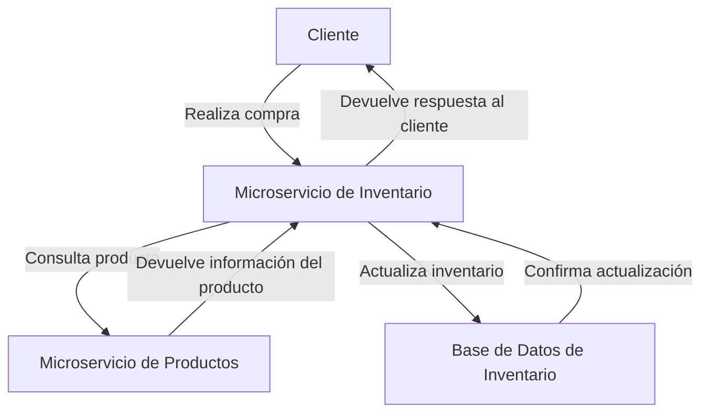

# Sistema de Gestión de Inventario y Productos

## Descripción

Este proyecto es un sistema de gestión de inventario y productos, implementado como microservicios utilizando Spring Boot y Docker. El sistema permite realizar compras y gestionar el inventario de productos a través de una API REST.

## Instrucciones de Instalación y Ejecución

### Prerequisitos

- [Docker](https://www.docker.com/get-started) (versión 20.10 o superior)
- [Docker Compose](https://docs.docker.com/compose/install/) (versión 1.29 o superior)

### Instalación

1. Clona el repositorio:

   ```bash
   git clone https://github.com/Juanara21/SistemaPos.git
   cd SistemaPos
   ```

2. Asegúrate de que Docker y Docker Compose estén instalados y en funcionamiento.

3. Ejecuta el siguiente comando para iniciar los servicios:

   ```bash
   docker-compose up --build
   ```

### Puertos disponibles

- Microservicio de Productos: http://localhost:8081
- Microservicio de Inventario: http://localhost:8083
- Base de datos de Inventario: Postgres en puerto 5431
- Base de datos de Productos: Postgres en puerto 5432

### Endpoints 

Los endpoints y sus distintos metodos se encuentran en el archivo de la colletion de postman
Sistema pos api.postman_collection.json

## Descripción de la Arquitectura

El sistema está compuesto por dos microservicios principales:

- Microservicio de Productos: Gestiona la información de los productos, incluyendo su creación, actualización y consulta.
- Microservicio de Inventario: Maneja el inventario de productos, permitiendo registrar, actualizar y realizar compras.

Ambos microservicios se comunican entre sí a través de HTTP, utilizando un API Key para la autenticación.

## Decisiones Técnicas y Justificaciones

- Elección de Microservicios: Se optó por una arquitectura de microservicios para permitir una escalabilidad y mantenimiento más sencillo. Cada microservicio puede ser desarrollado, desplegado y escalado de manera independiente.

- Implementación del Endpoint de Compra: El endpoint de compra se implementó en el microservicio de Inventario, ya que este microservicio es responsable de gestionar la cantidad de productos disponibles. Esto permite que la lógica de negocio relacionada con la compra y la gestión del inventario se mantenga en un solo lugar, facilitando el mantenimiento y la evolución del sistema.

## Diagrama de Interacción entre Servicios



## Explicación del Flujo de Compra Implementado

- El cliente realiza una solicitud de compra al microservicio de Inventario.
- El microservicio de Inventario consulta el microservicio de Productos para verificar la existencia del producto.
- Si el producto existe y hay suficiente inventario, se actualiza la cantidad en la base de datos de Inventario.
- Se devuelve una respuesta al cliente confirmando la compra.


## Contribuciones

Las contribuciones son bienvenidas. Si deseas contribuir a este proyecto, por favor abre un issue o envía un pull request.


